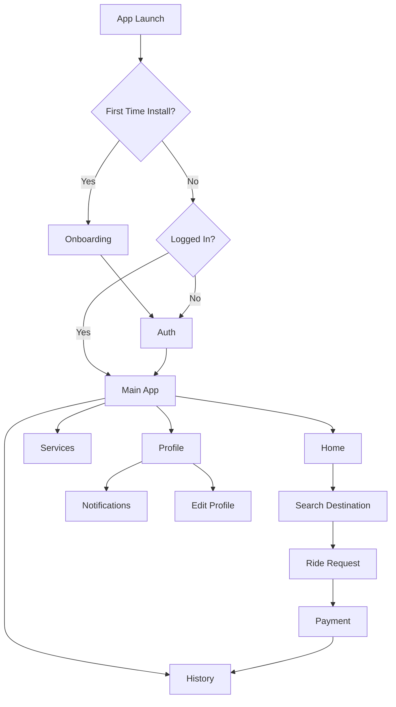

# RidezToHealth

RidezToHealth is a Flutter mobile app built around ride and transportation workflows with onboarding, authentication, mapping, services, payments, and profile/history flows. The codebase uses GetX for dependency injection and state, a feature-first layout, and a layered services/repository approach to keep UI, business logic, and data access cleanly separated.

## Overview

- App name: RidezToHealth
- Platforms: iOS, Android (Flutter)
- SDK: Flutter with Dart `^3.8.1`
- Version: `1.0.1+1`
- Architecture: Feature-first, GetX controllers + repositories + services

## Key Features

- Onboarding flow and first-time install checks
- Authentication with login, register, OTP, and password reset
- Home dashboard and service discovery
- Maps, routing, geolocation, and place search
- Real-time updates via Socket.IO
- Profile management and trip/history views
- Payments and wallet-related screens
- Local storage for tokens and user info
- Media handling with image and file pickers

## Screenshots

Place screenshots in `docs/screenshots/` using the filenames below.

| Screen | Preview |
| --- | --- |
| Home |  |
| Home (Recent Trips) |  |
| Services |  |
| Search Destination |  |
| History |  |
| Notifications |  |
| Profile Menu |  |
| Edit Profile |  |

## App Flow



## Architecture

- State and dependency management: GetX (`get`)
- Navigation: `GetMaterialApp` and a custom bottom navigation bar
- Feature modules: Each feature groups domain, data, controllers, and UI
- Remote data access: `ApiClient` + `SocketClient` under `lib/helpers/remote/`
- Local storage: `SharedPreferences` and `get_storage`

## Project Structure

```
lib/
  main.dart                         # App entry point, DI, initial routing
  app.dart                          # Main shell with bottom navigation
  core/                             # Shared constants, themes, widgets, utils, onboarding
  feature/                          # Feature modules
    auth/                           # Auth controllers, services, repos, UI
    home/                           # Home feature
    map/                            # Maps, location, routing
    payment/                        # Payment feature
    profileAndHistory/              # Profile and history feature
    serviceFeature/                 # Service list/details
  helpers/                          # DI, API client, socket client
  navigation/                       # Navigation widgets
  utils/                            # App-wide constants and helpers
assets/
  images/                           # Images
  icons/                            # Icons
```

## Dependencies

- `get` for state, navigation, and DI
- `dio` and `http` for networking
- `socket_io_client` for real-time updates
- `shared_preferences` and `get_storage` for local persistence
- `google_maps_flutter`, `geolocator`, `location`, `geocoding`, `flutter_polyline_points` for map and location features
- `image_picker` and `file_picker` for media/files
- `cached_network_image`, `shimmer`, `flutter_svg` for UI
- `webview_flutter` for embedded web content
- `intl` for formatting

## Getting Started

1. Install dependencies:
   ```bash
   flutter pub get
   ```

2. Configure API and Socket URLs:
   - Edit `lib/core/constants/urls.dart` for `baseUrl` and `socketUrl`.

3. Configure Maps API key:
   - Update `lib/utils/app_constants.dart` for `polylineMapKey`.
   - Add the same key to your Android and iOS platform configs.

4. Run the app:
   ```bash
   flutter run
   ```

## Configuration Notes

- Base URLs: `lib/core/constants/urls.dart`
- App constants and keys: `lib/utils/app_constants.dart`
- Launcher icons: `pubspec.yaml` under `flutter_launcher_icons`

To regenerate launcher icons:
```bash
flutter pub run flutter_launcher_icons
```

## Assets and Fonts

- Images: `assets/images/`
- Icons: `assets/icons/`
- Fonts: `assets/fonts/notoSansKR/` configured under `pubspec.yaml`

## Development Tips

- Entry points: `lib/main.dart`, `lib/app.dart`
- Dependency injection setup: `lib/helpers/dependency_injection.dart`
- Feature structure example: `lib/feature/auth/` with controllers, repositories, services, and presentation

## Testing

```bash
flutter test
```

## Security and Secrets

Do not commit real API keys or production credentials. Move sensitive values to secure configs or environment-specific builds.
