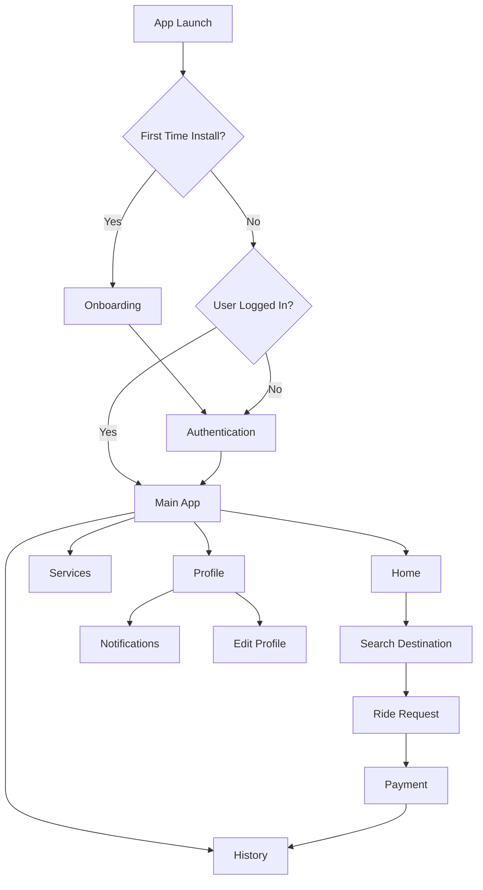

# RidezToHealth

A production-oriented Flutter mobile application for ride booking and transportation workflows, featuring onboarding, authentication, service discovery, maps and routing, payments, and profile/history management.

<p align="center">
  
  
  
  
  
</p>

---

## Overview

**RidezToHealth** is a Flutter-based transportation app designed around ride discovery and booking workflows. The project follows a feature-first structure with **GetX** for navigation, state management, and dependency injection, while repositories and services help separate UI concerns from networking and business logic.

### Project Summary

- **App Name:** RidezToHealth
- **Framework:** Flutter
- **Language:** Dart `^3.8.1`
- **Platforms:** Android, iOS
- **Version:** `1.0.1+2`
- **Architecture Style:** Feature-first + GetX + layered repositories/services

---

## Core Features

### User Experience
- First-time install detection and onboarding flow
- Clean authentication journey with login, registration, OTP verification, and password reset
- Home dashboard for ride-related discovery and app entry points
- Profile editing and account-related flows
- Trip and activity history views
- Notification and menu-based settings experience

### Transportation & Ride Flows
- Destination search and service selection
- Maps integration with location access and route support
- Ride request and transportation journey flow
- Service browsing and service-specific interactions
- Payment handling and wallet-related experiences

### Platform & System Capabilities
- Real-time communication through Socket.IO
- Token and local user data persistence
- Image and file picking support
- Embedded web content support where required
- Modular structure for scalable feature development

---

## Tech Stack

### State Management & Navigation
- `get`

### Networking & Realtime
- `dio`
- `http`
- `socket_io_client`

### Storage
- `shared_preferences`
- `get_storage`

### Maps & Location
- `google_maps_flutter`
- `geolocator`
- `location`
- `geocoding`
- `flutter_polyline_points`

### UI & Media
- `cached_network_image`
- `shimmer`
- `flutter_svg`
- `image_picker`
- `file_picker`
- `webview_flutter`
- `intl`

---

## Application Flow



---

## Architecture

The project uses a layered and maintainable Flutter structure:

### Architectural Principles
- **Feature-first organization** keeps modules grouped by business capability
- **GetX** manages navigation, controllers, and dependency injection
- **Repository and service layers** isolate network/data concerns from UI code
- **Reusable core and helper modules** centralize constants, utilities, and shared widgets
- **Remote and local data sources** support persistent sessions and real-time updates

### Main Building Blocks
- **Presentation Layer:** Flutter screens, widgets, and GetX controllers
- **Business Logic Layer:** Controllers and repositories that coordinate use cases
- **Data Layer:** Services, remote clients, and local persistence helpers
- **Infrastructure Layer:** App constants, themes, utilities, DI, and socket/API clients

### Remote & Local Access
- Remote communication is handled through `ApiClient` and `SocketClient`
- Local persistence uses `SharedPreferences` and `get_storage`

---

## Project Structure

```text
lib/
  main.dart                         # App entry point, DI bootstrap, initial routing
  app.dart                          # Main shell and bottom navigation setup
  core/                             # Shared constants, themes, widgets, onboarding, utilities
  feature/                          # Feature modules
    auth/                           # Authentication flows and logic
    home/                           # Home dashboard and primary user flows
    map/                            # Maps, routing, and geolocation logic
    payment/                        # Payment-related UI and logic
    profileAndHistory/              # Profile management and ride/trip history
    serviceFeature/                 # Service discovery and service details
  helpers/                          # Dependency injection, API client, socket client
  navigation/                       # Navigation widgets/components
  utils/                            # App-wide helpers, constants, and utility logic
assets/
  images/                           # Image assets
  icons/                            # Icon assets
  fonts/                            # Custom fonts referenced by pubspec.yaml
```

---

## Screenshots

Store screenshots in `docs/screenshots/` using the following file names.

| Screen | Preview |
| --- | --- |
| Home |  |
| Home (Recent Trips) |  |
| Services |  |
| Search Destination |  |
| History |  |
| Notifications |  |
| Profile Menu |  |
| Edit Profile |  |

> Tip: add compressed screenshots with consistent dimensions for a cleaner GitHub presentation.

---

## Prerequisites

Before running the app, ensure your environment includes:

- Flutter SDK installed and configured
- Dart SDK compatible with the project
- Android Studio or VS Code with Flutter extensions
- Android SDK / Xcode toolchain configured
- A physical device or emulator/simulator
- Valid API endpoints and map credentials

Check your Flutter environment:

```bash
flutter doctor
```
