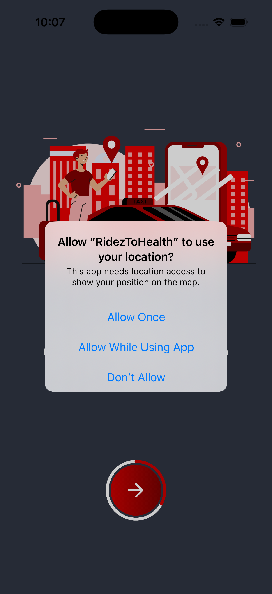
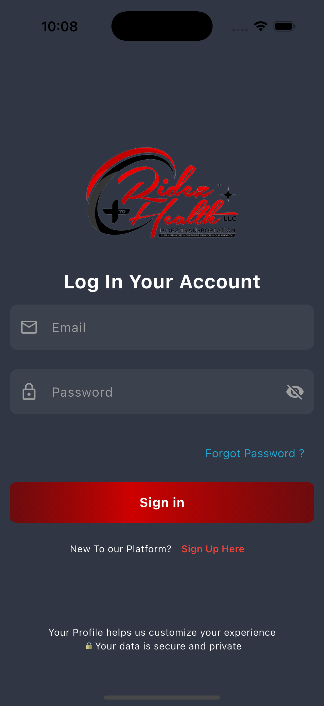
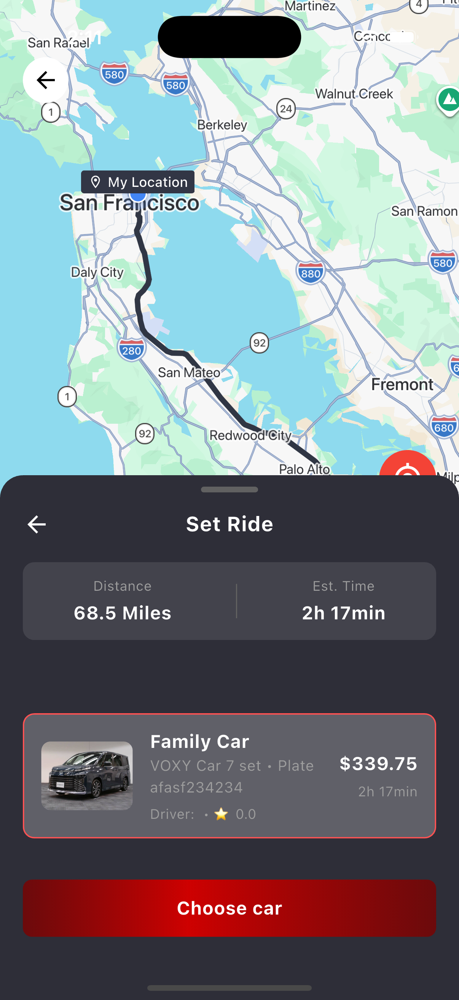
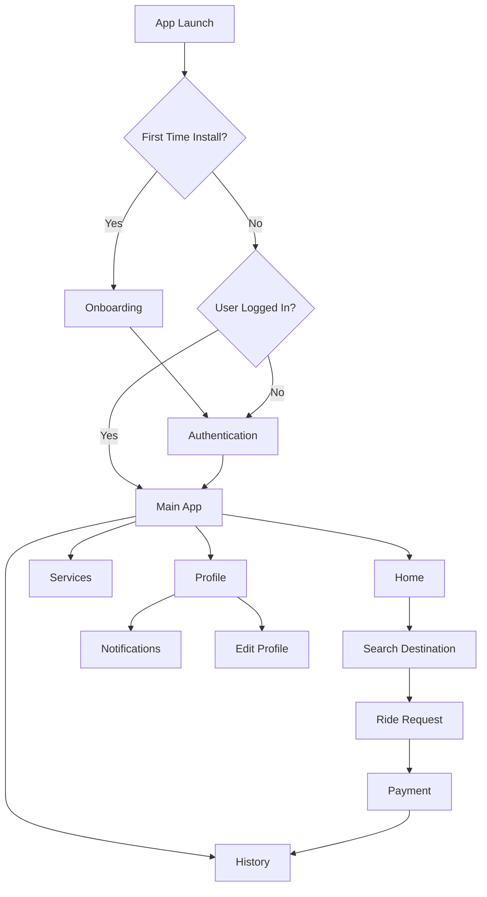
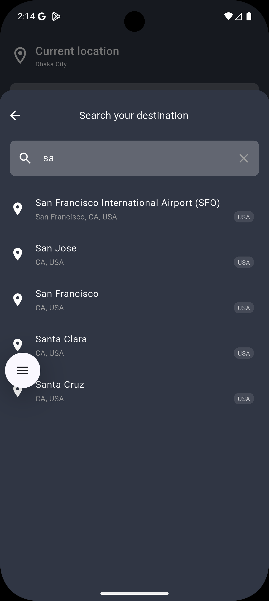
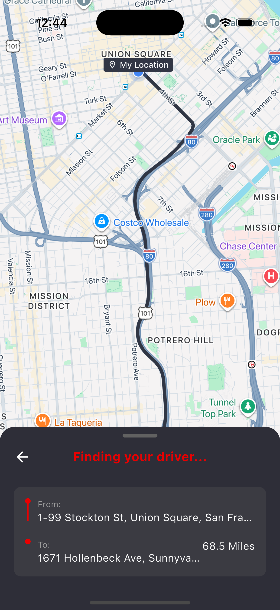
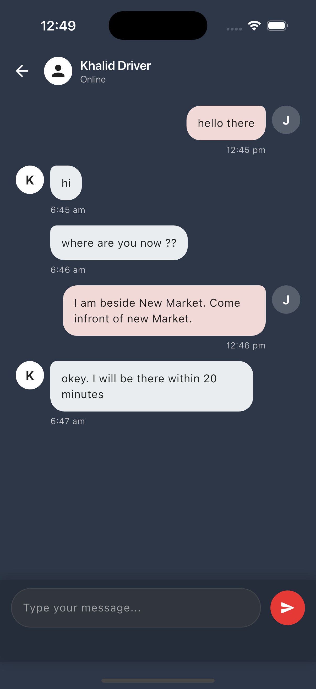

# RidezToHealth

<p align="center">
  
</p>

<p align="center">
  A professional Flutter ride-booking application focused on transportation, routing, ride requests, payments, and account management.
</p>

<p align="center">
  
  
  
  
  
</p>

## App Preview

<table>
  <tr>
    <td align="center"></td>
    <td align="center"></td>
    <td align="center"></td>
  </tr>
  <tr>
    <td align="center"></td>
    <td align="center"></td>
    <td align="center"></td>
  </tr>
</table>

## App Download

<p align="center">
  <a href="https://play.google.com/store/apps/details?id=com.rideztransportation.rideztohealth&pcampaignid=web_share">
    
  </a>
  <a href="https://apps.apple.com/us/app/rideztohealth/id6756919658">
    
  </a>
</p>

<p align="center">
  <strong>Primary APK / Android access:</strong>
  <a href="https://play.google.com/store/apps/details?id=com.rideztransportation.rideztohealth&pcampaignid=web_share">Get RidezToHealth on Google Play</a>
</p>

---

## Links

### Design

- [Open Figma File](https://figma.com/design/ZR49xOiUxz9xfC0CaRGO7h/rideztohealth--Final-Copy-?t=nUuLZyRfdywHq5no-0)

### Store Links

| App | Google Play | App Store |
| --- | --- | --- |
| RidezToHealth | [Open](https://play.google.com/store/apps/details?id=com.rideztransportation.rideztohealth&pcampaignid=web_share) | [Open](http://apps.apple.com/us/app/rideztohealth/id6756919658) |
| RidezToHealth Driver | [Open](https://play.google.com/store/apps/details?id=com.rideztransportation.ridetohealthdriver&pcampaignid=web_share) | [Open](http://apps.apple.com/us/app/ridetohealth-driver/id6756962378) |

---

## Core Features

### User Experience
- First-time install detection and onboarding flow
- Clean authentication journey with login, registration, OTP verification, and password reset
- Home dashboard for ride-related discovery and app entry points
- Profile editing and account-related flows
- Trip and activity history views
- Notification and menu-based settings experience

### Transportation & Ride Flows
- Destination search and service selection
- Maps integration with location access and route support
- Ride request and transportation journey flow
- Service browsing and service-specific interactions
- Payment handling and wallet-related experiences

### Platform & System Capabilities
- Real-time communication through Socket.IO
- Token and local user data persistence
- Image and file picking support
- Embedded web content support where required
- Modular structure for scalable feature development

---

## Tech Stack

### State Management & Navigation
- `get`

### Networking & Realtime
- `dio`
- `http`
- `socket_io_client`

### Storage
- `shared_preferences`
- `get_storage`

### Maps & Location
- `google_maps_flutter`
- `geolocator`
- `location`
- `geocoding`
- `flutter_polyline_points`

### UI & Media
- `cached_network_image`
- `shimmer`
- `flutter_svg`
- `image_picker`
- `file_picker`
- `webview_flutter`
- `intl`

---

## Application Flow



---

## Architecture

The project uses a layered and maintainable Flutter structure:

### Architectural Principles
- **Feature-first organization** keeps modules grouped by business capability
- **GetX** manages navigation, controllers, and dependency injection
- **Repository and service layers** isolate network/data concerns from UI code
- **Reusable core and helper modules** centralize constants, utilities, and shared widgets
- **Remote and local data sources** support persistent sessions and real-time updates

### Main Building Blocks
- **Presentation Layer:** Flutter screens, widgets, and GetX controllers
- **Business Logic Layer:** Controllers and repositories that coordinate use cases
- **Data Layer:** Services, remote clients, and local persistence helpers
- **Infrastructure Layer:** App constants, themes, utilities, DI, and socket/API clients

### Remote & Local Access
- Remote communication is handled through `ApiClient` and `SocketClient`
- Local persistence uses `SharedPreferences` and `get_storage`

---

## Project Structure

```text
lib/
  main.dart                         # App entry point, DI bootstrap, initial routing
  app.dart                          # Main shell and bottom navigation setup
  core/                             # Shared constants, themes, widgets, onboarding, utilities
  feature/                          # Feature modules
    auth/                           # Authentication flows and logic
    home/                           # Home dashboard and primary user flows
    map/                            # Maps, routing, and geolocation logic
    payment/                        # Payment-related UI and logic
    profileAndHistory/              # Profile management and ride/trip history
    serviceFeature/                 # Service discovery and service details
  helpers/                          # Dependency injection, API client, socket client
  navigation/                       # Navigation widgets/components
  utils/                            # App-wide helpers, constants, and utility logic
assets/
  images/                           # Image assets
  icons/                            # Icon assets
  fonts/                            # Custom fonts referenced by pubspec.yaml
```

---

## Screenshots

The following app screenshots are included in `docs/screenshots/`.

<table>
  <tr>
    <td align="center"><strong>Onboarding Location Permission</strong><br></td>
    <td align="center"><strong>Login</strong><br></td>
    <td align="center"><strong>Home</strong><br></td>
  </tr>
  <tr>
    <td align="center"><strong>Search Destination</strong><br></td>
    <td align="center"><strong>Search Destination Android</strong><br></td>
    <td align="center"><strong>Set Ride</strong><br></td>
  </tr>
  <tr>
    <td align="center"><strong>Finding Driver</strong><br></td>
    <td align="center"><strong>Driver Chat</strong><br></td>
    <td align="center"><strong>Notifications</strong><br></td>
  </tr>
  <tr>
    <td align="center"><strong>Profile Menu</strong><br></td>
    <td align="center"><strong>Edit Profile</strong><br></td>
  </tr>
  
</table>


---

## Prerequisites

Before running the app, ensure your environment includes:

- Flutter SDK installed and configured
- Dart SDK compatible with the project
- Android Studio or VS Code with Flutter extensions
- Android SDK / Xcode toolchain configured
- A physical device or emulator/simulator
- Valid API endpoints and map credentials

Check your Flutter environment:

```bash
flutter doctor
```

