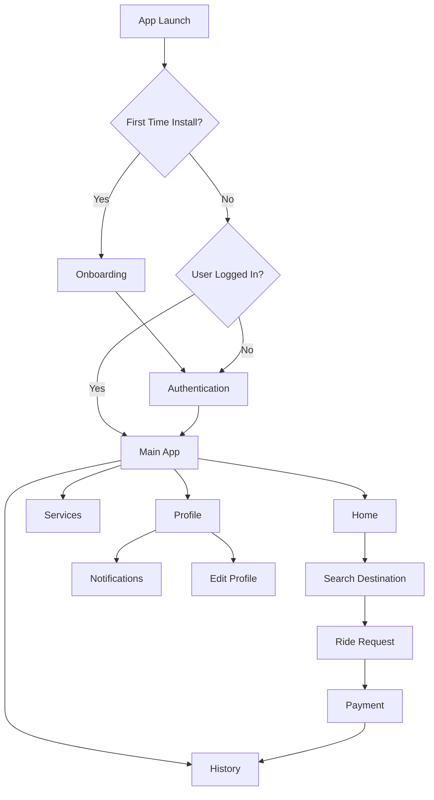
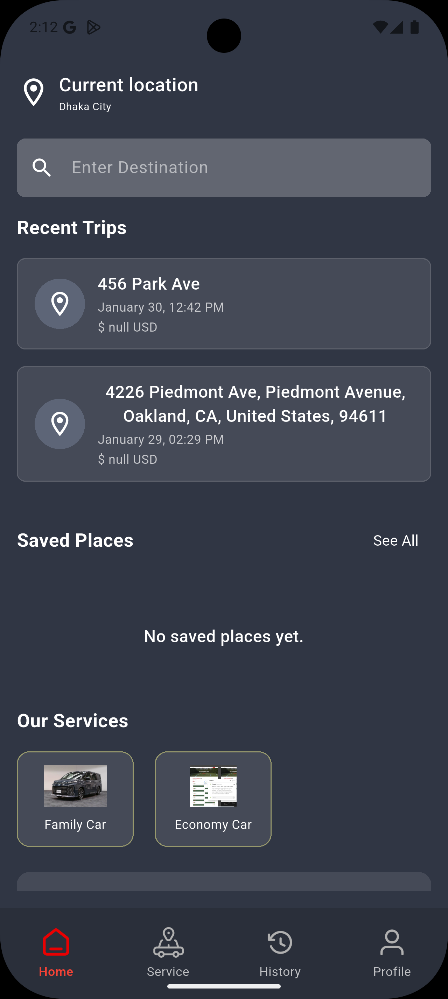
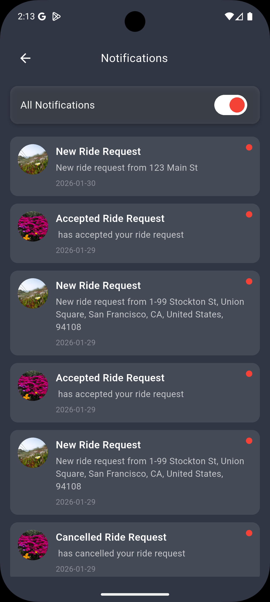
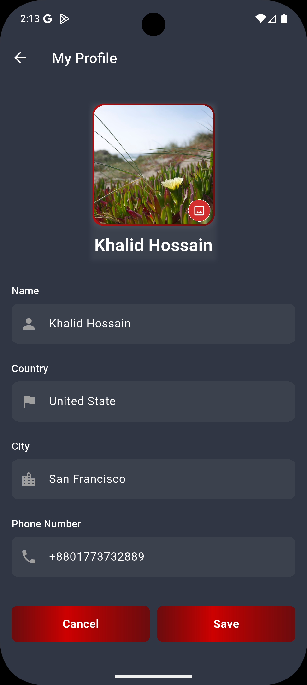
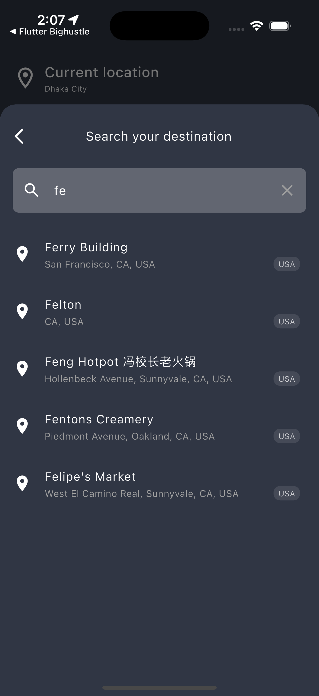
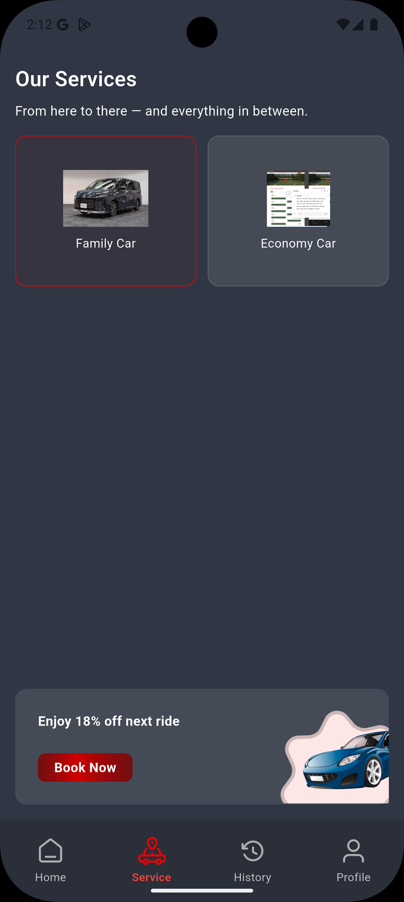
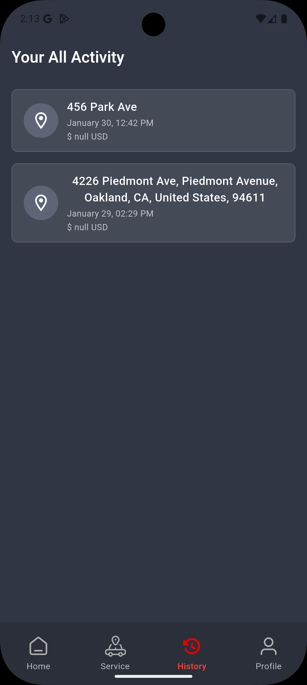
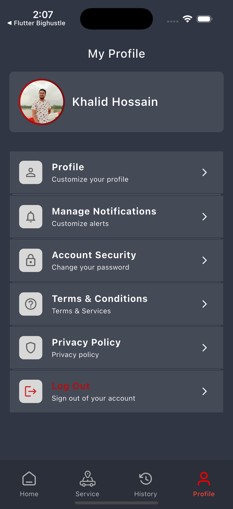
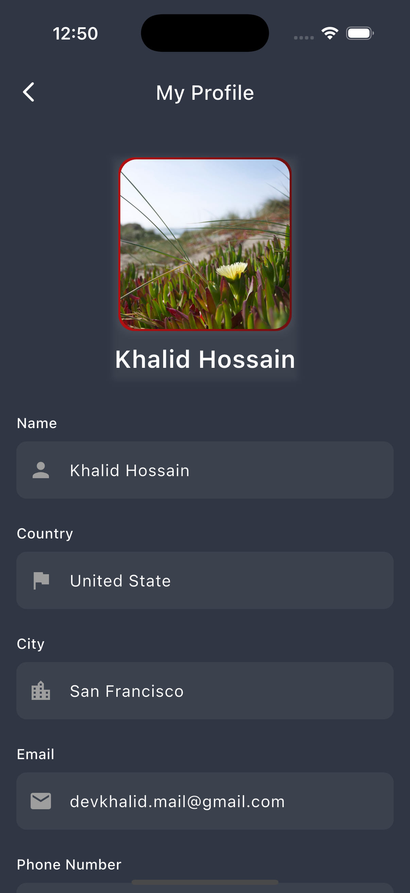

# RidezToHealth

A production-oriented Flutter mobile application for ride booking and transportation workflows, featuring onboarding, authentication, service discovery, maps and routing, payments, and profile/history management.

<p align="center">
  
  
  
  
  
</p>

---

## Table of Contents

- [Overview](#overview)
- [Core Features](#core-features)
- [Tech Stack](#tech-stack)
- [Application Flow](#application-flow)
- [Architecture](#architecture)
- [Project Structure](#project-structure)
- [Screenshots](#screenshots)
- [Prerequisites](#prerequisites)
- [Getting Started](#getting-started)
- [Configuration](#configuration)
- [Running the App](#running-the-app)
- [Testing](#testing)
- [Build Notes](#build-notes)
- [Development Guidelines](#development-guidelines)
- [Security](#security)
- [Troubleshooting](#troubleshooting)
- [License](#license)

---

## Overview

**RidezToHealth** is a Flutter-based transportation app designed around ride discovery and booking workflows. The project follows a feature-first structure with **GetX** for navigation, state management, and dependency injection, while repositories and services help separate UI concerns from networking and business logic.

### Project Summary

- **App Name:** RidezToHealth
- **Framework:** Flutter
- **Language:** Dart `^3.8.1`
- **Platforms:** Android, iOS
- **Version:** `1.0.1+2`
- **Architecture Style:** Feature-first + GetX + layered repositories/services

---

## Core Features

### User Experience
- First-time install detection and onboarding flow
- Clean authentication journey with login, registration, OTP verification, and password reset
- Home dashboard for ride-related discovery and app entry points
- Profile editing and account-related flows
- Trip and activity history views
- Notification and menu-based settings experience

### Transportation & Ride Flows
- Destination search and service selection
- Maps integration with location access and route support
- Ride request and transportation journey flow
- Service browsing and service-specific interactions
- Payment handling and wallet-related experiences

### Platform & System Capabilities
- Real-time communication through Socket.IO
- Token and local user data persistence
- Image and file picking support
- Embedded web content support where required
- Modular structure for scalable feature development

---

## Tech Stack

### State Management & Navigation
- `get`

### Networking & Realtime
- `dio`
- `http`
- `socket_io_client`

### Storage
- `shared_preferences`
- `get_storage`

### Maps & Location
- `google_maps_flutter`
- `geolocator`
- `location`
- `geocoding`
- `flutter_polyline_points`

### UI & Media
- `cached_network_image`
- `shimmer`
- `flutter_svg`
- `image_picker`
- `file_picker`
- `webview_flutter`
- `intl`

---

## Application Flow



---

## Architecture

The project uses a layered and maintainable Flutter structure:

### Architectural Principles
- **Feature-first organization** keeps modules grouped by business capability
- **GetX** manages navigation, controllers, and dependency injection
- **Repository and service layers** isolate network/data concerns from UI code
- **Reusable core and helper modules** centralize constants, utilities, and shared widgets
- **Remote and local data sources** support persistent sessions and real-time updates

### Main Building Blocks
- **Presentation Layer:** Flutter screens, widgets, and GetX controllers
- **Business Logic Layer:** Controllers and repositories that coordinate use cases
- **Data Layer:** Services, remote clients, and local persistence helpers
- **Infrastructure Layer:** App constants, themes, utilities, DI, and socket/API clients

### Remote & Local Access
- Remote communication is handled through `ApiClient` and `SocketClient`
- Local persistence uses `SharedPreferences` and `get_storage`

---

## Project Structure

```text
lib/
  main.dart                         # App entry point, DI bootstrap, initial routing
  app.dart                          # Main shell and bottom navigation setup
  core/                             # Shared constants, themes, widgets, onboarding, utilities
  feature/                          # Feature modules
    auth/                           # Authentication flows and logic
    home/                           # Home dashboard and primary user flows
    map/                            # Maps, routing, and geolocation logic
    payment/                        # Payment-related UI and logic
    profileAndHistory/              # Profile management and ride/trip history
    serviceFeature/                 # Service discovery and service details
  helpers/                          # Dependency injection, API client, socket client
  navigation/                       # Navigation widgets/components
  utils/                            # App-wide helpers, constants, and utility logic
assets/
  images/                           # Image assets
  icons/                            # Icon assets
  fonts/                            # Custom fonts referenced by pubspec.yaml
```

---

## Screenshots

Store screenshots in `docs/screenshots/` using the following file names.

| Screen | Preview |
| --- | --- |
| Home |  |
| Home (Recent Trips) |  |
| Services |  |
| Search Destination |  |
| History |  |
| Notifications |  |
| Profile Menu |  |
| Edit Profile |  |

> Tip: add compressed screenshots with consistent dimensions for a cleaner GitHub presentation.

---

## Prerequisites

Before running the app, ensure your environment includes:

- Flutter SDK installed and configured
- Dart SDK compatible with the project
- Android Studio or VS Code with Flutter extensions
- Android SDK / Xcode toolchain configured
- A physical device or emulator/simulator
- Valid API endpoints and map credentials

Check your Flutter environment:

```bash
flutter doctor
```

---

## Getting Started

### 1. Clone the repository

```bash
git clone <your-repository-url>
cd rideztohealth
```

### 2. Install dependencies

```bash
flutter pub get
```

### 3. Verify Flutter setup

```bash
flutter doctor
```

### 4. Run the application

```bash
flutter run
```

---

## Configuration

### API and Socket Configuration
Update the backend endpoints in:

```text
lib/core/constants/urls.dart
```

Expected values include:
- `baseUrl`
- `socketUrl`

### Maps Configuration
Update the polyline/maps key in:

```text
lib/utils/app_constants.dart
```

Expected value:
- `polylineMapKey`

### Platform Setup
Make sure the same map key is correctly configured in platform-specific files:
- **Android:** `AndroidManifest.xml` or related Google Maps config
- **iOS:** `Info.plist` or native map setup files

### Launcher Icons
Launcher icon configuration is defined in:

```text
pubspec.yaml
```

Regenerate launcher icons:

```bash
flutter pub run flutter_launcher_icons
```

---

## Testing

Run unit and widget tests with:

```bash
flutter test
```

Recommended additions for long-term maintainability:
- Controller-level unit tests
- Repository and service mock tests
- Widget tests for critical user flows
- Integration tests for authentication, booking, and payment journeys

---

## Development Guidelines

### Important Entry Files
- `lib/main.dart`
- `lib/app.dart`

### Dependency Injection
- `lib/helpers/dependency_injection.dart`

### Key Config Files
- `lib/core/constants/urls.dart`
- `lib/utils/app_constants.dart`
- `pubspec.yaml`

### Suggested Development Practices
- Keep feature logic inside its corresponding module
- Avoid mixing API calls directly into UI widgets
- Use repositories/services for data access orchestration
- Centralize constants and environment-sensitive values
- Reuse widgets from `core/` where possible
- Keep controller responsibilities focused and testable

---

## Security

Never commit:
- Production API keys
- Real socket endpoints for secure environments
- Authentication secrets or tokens
- Signing credentials or private certificates

### Recommended Improvements
- Move secrets to environment-specific configuration
- Use secure storage for sensitive tokens when applicable
- Separate development, staging, and production builds
- Validate all backend-driven values before use in the UI
